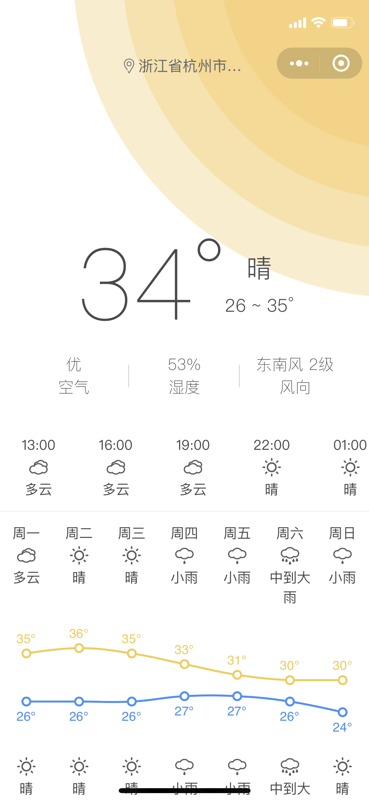
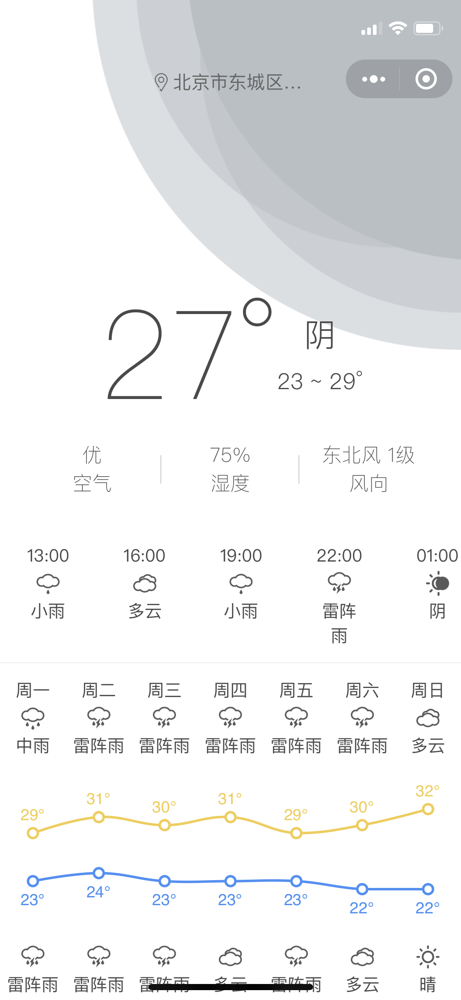
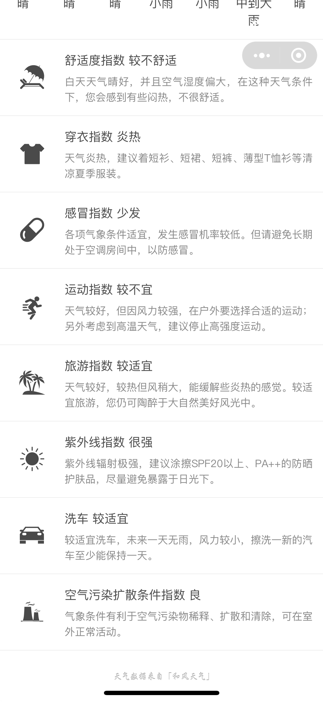

# 瓜皮天气

<p align="center">
  
</p>

瓜皮天气微信小程序，个人初学小程序练手所写，基于 taro + ts + mobx 开发，天气背景素材用 sketch 临摹自 https://dribbble.com/shots/3802809-Weather-A, 侵权联系必删。
为了保护个人隐私，有个配置文件未上传，请自行申请对应开发者账号，并按照以下格式新增 `src/common/const.ts`

```typescript
// src/common/const.ts
const QQ_MAP_KEY = '' // 腾讯地图 key
const GEOCODER_URL = 'https://apis.map.qq.com/ws/geocoder/v1/' // 腾讯地图逆地址解析 url
const HEFENG_BASE_URL = 'https://free-api.heweather.net/s6/' // 和风天气 base url
const HEFENG_KEY = '' // 和风天气 key

export { QQ_MAP_KEY, GEOCODER_URL, HEFENG_BASE_URL, HEFENG_KEY }
```

## 特点

- 简约美观
- 自动定位，支持地图上直接挑选位置
- 当前天气信息，空气质量等
- 后几个小时天气预报
- 7 天内天气图表显示
- 生活指数推荐

## 预览

<p align="center">
  
  
  
  
</p>
